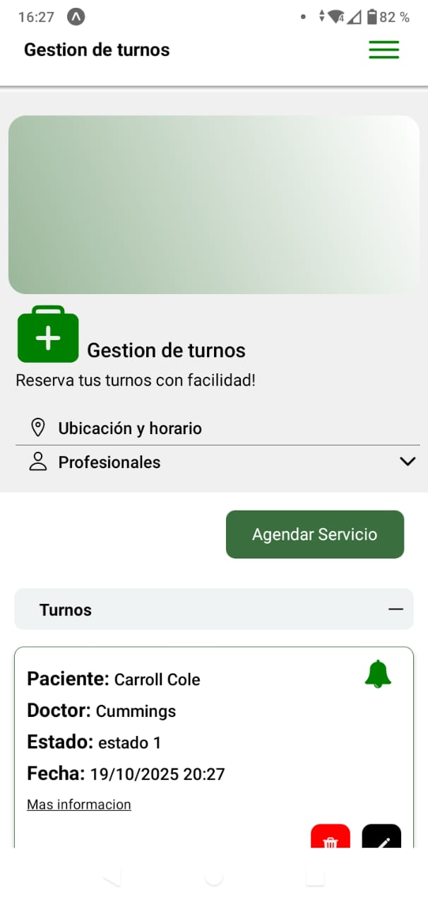
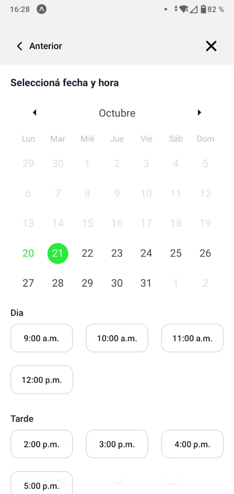
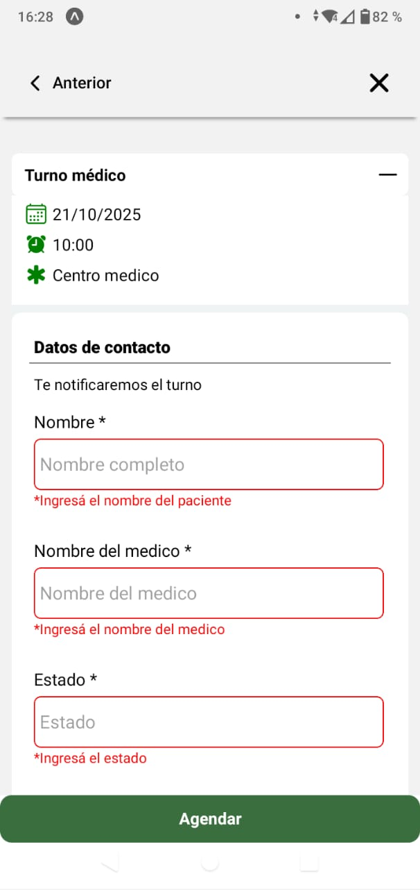

## Get started

1. Install dependencies

   npm install

2. Start the app

   npx expo start

3. crear un archivo .env para la EXPO_PUBLIC_API_URL

🧩 Descripción general

Aplicación móvil desarrollada con React Native (Expo) que permite gestionar turnos médicos, incluyendo creación, edicion, listado y eliminación de turnos con validaciones y persistencia de estado global.

⚙️ Tecnologías principales

React Native con Expo → Framework para el desarrollo móvil multiplataforma (Android / iOS).

React Hook Form → Manejo y validación de formularios de forma eficiente y declarativa.

Redux Toolkit → Control del estado global de la aplicación.

Jotai → Control del estado global del theme de la aplicacion.

React Navigation / Expo Router → Navegación entre pantallas (Home, Crear turno, Login, etc.).

React Query → Manejo de peticiones asíncronas para comunicación con API o backend.

TypeScript → Tipado estático que mejora la seguridad y mantenibilidad del código.

FLUJO DEL SISTEMA:

